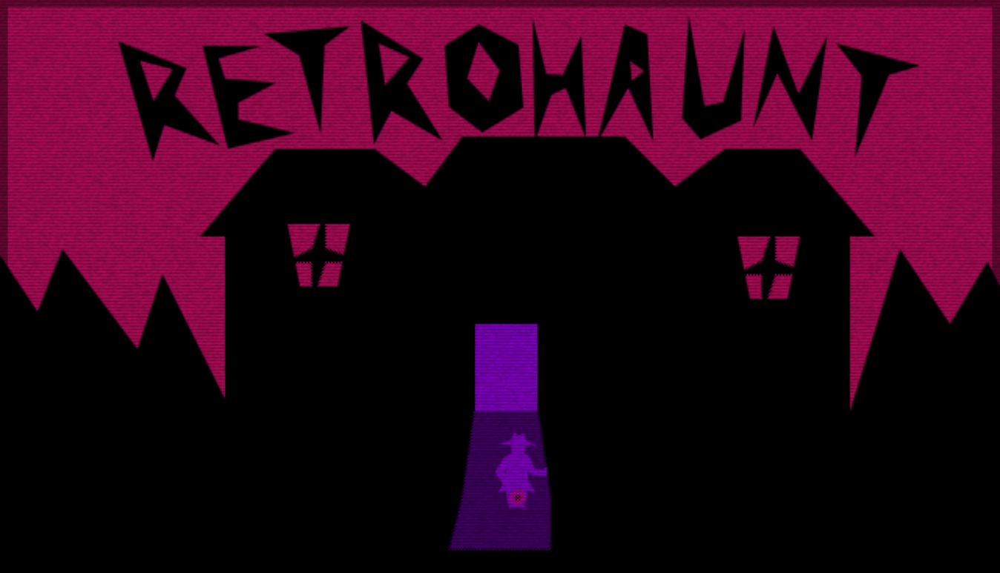
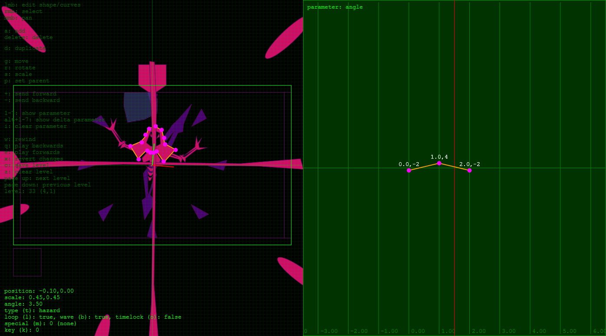

# Retrohaunt Postmortem (js13kgames 2019)

[LINK TO GAME](https://js13kgames.com/games/retrohaunt/index.html)

This was the second year in a row I participated in the [js13kgames](https://js13kgames.com/) coding competition. Although I prefer the shorter competitions such as [Ludum Dare](https://ldjam.com/) due to the strict time limitations, I have found that js13k is an appealing format for game development. 13 K is not so small that your only focus is on reducing code size using dirty Javascript hacks, but not so large that you can just make anything without a care.

## The idea

The theme of js13kgames this year was "Back". 

Retrohaunt started as a simple idea: Avoiding animated vector shapes. Hovering over certain shapes would change the flow of time, which would help the player solve certain puzzles.

A core aspect of the game was that simple 2D shapes can be stored in a relatively small amount of space. If multiple shapes are repeated or look similar to other shapes they will have a high compression ratio, allowing for quite elaborate levels. This should allow the game to have a lot of content, even in just 13 K.

Building on this concept, I originally envisioned the game being a mouse labyrinth style game (like the Scary Maze Game I'm sure many know). Over time this concept morphed into a more classic top-down puzzle game. Later yet an element of nonlinearity was added because I love Metroidvanias!

## The code

The core game loop of the Retrohaunt was written to be as generic as possible. Most of the actions and events in the game were baked into the level data itself, rather than explicitly coded as one-off functions. This allowed the main loop to stay relatively lightweight in comparison to the level data.

The shape format defines a single polygon and is the core entity of the game:
~~~
0: x
1: y
2: angle
3: scale_x
4: scale_y
5: context
6: time
7: parent
8: type
9: special
10: key
11: vertices [...]
12: parameter animations [...]
~~~

A persistent *keys* set stores the state of the world.

The main loop updates an array of shapes according to a set of rules. These are some of the rules:

 * set key *n* on player touch
 * chase player with *context* speed
 * freeze own time until key *n* is set

From the start I had decided to only use the [Closure Compiler](https://developers.google.com/closure/compiler/) and ZIP compression to minimize the game, and the code was written in such a way to take that into consideration. For example, I avoided the use of temporary variables in favor of repeating code:
~~~
const dx = Math.cos(d / 4 * Math.PI) * 10 * (d < 8);
const dy = Math.sin(d / 4 * Math.PI) * 10 * (d < 8);
~~~

A small python script was used to bundle/closure compile/compress the game. This was a lifesaver as I could get direct feedback over how much space was remaining.

## The editor

For editing and animating the shapes some type of level editor was required. My choices were to either retrofit an existing program, such as Inkscape or Blender, or to create an editor from scratch. I choose the second option.

The editor started out simple. As the complexity of the game grew I kept adding features to it, until at the end it was a fully fledged, albeit primitive, vector editor and animator. The editor supports editing nested objects with relative transforms.

## What went right

* When the game was complete it was just under 13 K. Did not have to sacrifice a thing!

* I'm very happy with how some of the rooms turned out, such as the boss worm.

## What went wrong

* I will admit that most of the game levels were unfinished until a few days before deadline. I had spent more time ironing out the level editor and core game code than actually creating content for the game. This lead to some of the rooms being rushed in the final days.

* The last thing added to the game was the music. I really wish I had spent more time on it and spent a few seconds longer making the loops seamless.

* Wait... I'm allowed to use three.js? Do'h!

## Wrap-up

I had another blast making this game. Will definitely be joining js13k next year, just for the fun of it!

